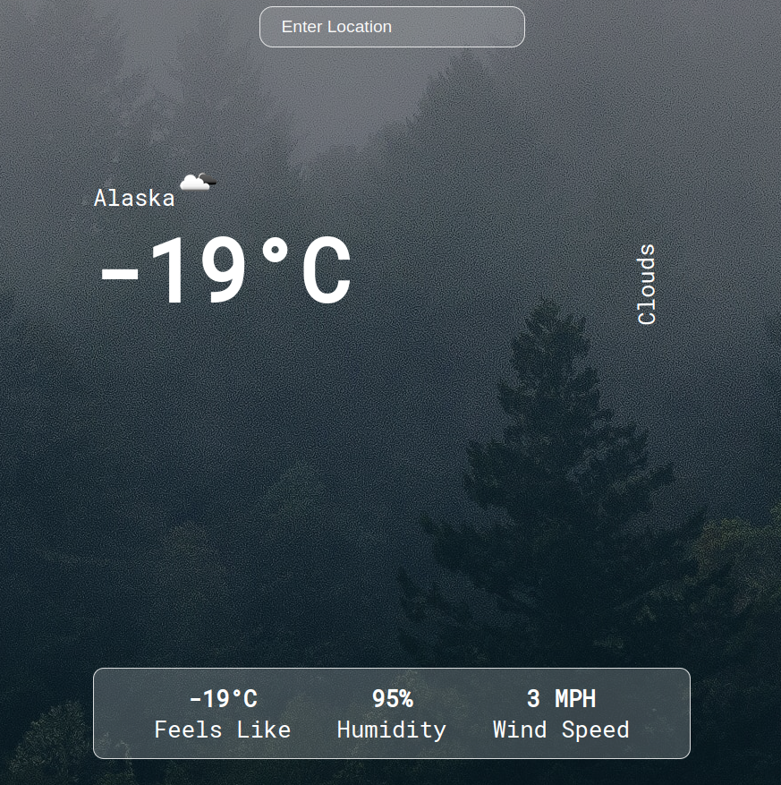

# WEATHER APP WITH REACT

---

## Knowledges:

- ReactJS
- axios

---

## How to use:

To clone and run this application, you'll need [Git](https://git-scm.com/downloads) and [ReactJS](https://reactjs.org/) installed on your computer. From your command line:

```bash

git clone https://github.com/Moabbasi378/weather-app


cd weather-app


npm install


npm start

```

---

## Demo:

- [Click Here](https://helpful-naiad-116e60.netlify.app/) to see and use a demo of the app.

## 

---

## Contact:

- [E-mail](mailto:carloinred@gmail.com)
